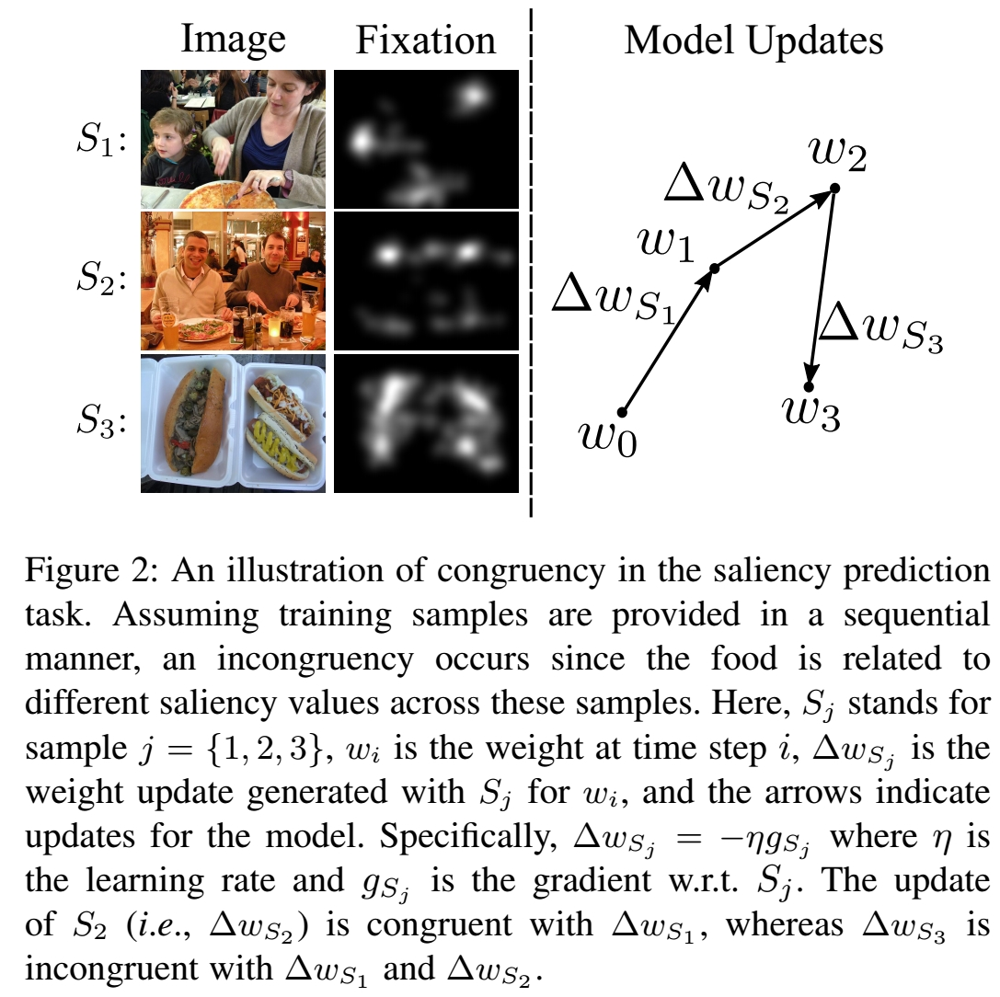

# Direction Concentration Learning: Enhancing Congruency in Machine Learning
<p align="center">
  <b>Luo, Yan and Wong, Yongkang and Kankanhalli, Mohan S and Zhao, Qi</b></span>
</p>

This repository contains the code for the **continual learning** task. For the classification task, please refer to repository [congruency](https://github.com/luoyan407/congruency).<br/>
DCL is a work that studies the agreement between the learned knowledge and the new information in a learning process. The code is built upon PyTorch and [GEM](https://github.com/facebookresearch/GradientEpisodicMemory). It is tested under Ubuntu 1604 LTS with Python 3.6. State-of-the-art EfficientNets are included.
<p align="center">

</p>

# TOC
1. [Prerequisites](#prerequisites)
2. [Results](#results)
3. [Experiments](#experiments)
4. [Pretrained Model](#pretrained-model)
5. [Citation](#citation)


## Prerequisites
1. [PyTorch 0.4.1](https://pytorch.org/get-started/previous-versions/), e.g.,
```bash
conda install pytorch=0.4.1 cuda80 -c pytorch # for CUDA 8.0
conda install pytorch=0.4.1 cuda90 -c pytorch # for CUDA 9.0
```
To use [EfficientNet](https://github.com/lukemelas/EfficientNet-PyTorch) as the baseline model, it requires [PyTorch 1.1.0+](https://pytorch.org/), e.g., 
```bash
conda install pytorch==1.1.0 torchvision==0.3.0 cudatoolkit=10.0 -c pytorch
```
2. [torchvision 0.2.1+](http://deepmind.github.io/torch-distributions/), e.g.,
```bash
pip install torchvision==0.2.1
```
3. [quadprog](https://pypi.org/project/quadprog/), i.e.,
```bash
pip install msgpack
pip install Cython
pip install quadprog
```
4. [EfficientNet](https://github.com/lukemelas/EfficientNet-PyTorch) (optinal), i.e.,
```bash
pip install efficientnet_pytorch
```
5. [TensorboardX](https://pypi.org/project/tensorboardX/) (optinal)
```bash
pip install tensorboardX==1.2
```

## Results
<p align="center">

</p>

## Experiments
To run the experiments on MNIST-R, MNIST-P, and iCIFAR-100, excute script run_experiments.sh

```bash  
./run_experiments.sh
```

## Pretrained Model
### iCIFAR-100
The pre-trained models, i.e., EfficientNet-B1 w.r.t. various DCL effetive windows, and corresponding training log/performance are are available at the shared drive [continual_pretrained](https://drive.google.com/open?id=1PxwiR29DLIsq4CYq9YS6pEjD239gS0XG).

## Citation
If you find this work or the code useful in your research, please consider citing:

	@article{Luo_DCL_2019,
	  title={Direction Concentration Learning: Enhancing Congruency in Machine Learning},
	  author={Luo, Yan and Wong, Yongkang and Kankanhalli, Mohan S and Zhao, Qi}
	}


## Contact
luoxx648 at umn.edu   
Any discussions, suggestions, and questions are welcome!
